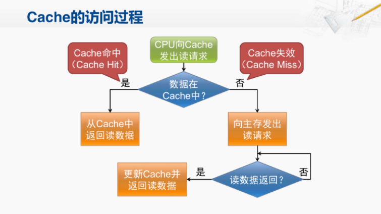

# C-Library

## C RAII思想模拟实现

​	**什么是RAII?** 

​	RAII（Resource Acquisition Is Initializing），也就是**资源获取即初始化**。其核心思想是：**将资源的获取与对象的初始化绑定，并在对象生命周期结束时自动释放资源**。虽然在C语言中并没有像C++一样的离开作用域自动调用析构函数，但可以通过一些途径来模拟其实现。

​	对于 `GCC/Clang` 编译器，其提供了关键工具：

```c
__attribute__((cleanup))
```

用于为每个资源定义专用的清理函数。**并且实现当离开作用域时，自动调用清理函数释放资源的功能。**

​	其中值得注意的是：**清理函数必须遵循特定的函数签名。**

```c
void cleanup_function(void *ptr);
```


## 柔性数组与可变长数组

​	柔性数组是 C99 标准中引入的一种特性，**主要用于在结构体的末尾声明一个长度未定的数组**。它允许**更高效地管理动态内存**，尤其是在需要将**结构体和变长数据连续存储的场景**中。

### **基本定义：**

​	在结构体的**最后一个成员位置**，声明一个未指定长度的数组（在C99标准下，【】内不需要写0。但是对于部分编译器为了兼容性可以写0）。

```c
// 柔性数组 C99标准写法
typedef struct {
  int length;
  int data[];
} Array_Int;

// 旧式兼容性写法。
// typedef struct {
//   int length;
//   int data[0];
// } Array_Int;
```

​	注意：一个结构体只能包含一个柔性数组！像下列的写法是错误的。

```c
typedef struct {
  int length_int;
  int length_char;
  int data_int[];
  char data_char[];
} Array_Int;
//这种写法是完全错误的！
```

- **柔性数组本身不占用结构体的内存空间**（`sizeof(Array_Int)` 不包含 `data` 的大小）。
- **需要手动分配内存来容纳结构体本身和柔性数组所需的空间。**

### **使用：**

​	计算好内存之后直接通过`malloc`一次分配进行使用。**计算总内存大小：结构体本身 + 柔性数组所需空间。**

```c
Array_Int* function_NewArray(int length) {
  assert(length > 0);
  Array_Int* myArr = (Array_Int*)malloc(sizeof(Array_Int) + sizeof(int) * length);
  if (!myArr) {
    fprintf(stderr , "Error on Allocate Array.");
    return 0;
  }
  myArr->length = length;
  return myArr;
}
```

​	访问时直接通过柔性数组名操作数据：

```c
  for(int i = 0 ; i < Arr->length ; ++i) {
    printf("%d  ", Arr->data[i]);
  }
```

​	**内存释放时只需要释放一次。**（传统的变长数组需要两次释放）。

```c
free(s); // 同时释放结构体和柔性数组的内存
```


### **传统可变长数组：**

```c
typedef struct {
  int length;
  char* data;
} Old_Arr;
```

​	传统可变长数组相比起柔性数组而言：

1：**需要两次内存分配**，结构体和 `data` 指向的内存块需要分别分配。

```c
// 第一次内存分配（结构体）
  Old_Arr* old_arr = (Old_Arr*)malloc(sizeof(Old_Arr));
  if (!old_arr) {
	...
  }
  old_arr->length = length;

  // 第二次内存分配（分配数组空间）
  old_arr->data = (char*)malloc(length + 1);
  if (!old_arr->data) {
 	...
  }
```

2：**传统可变长数组内部数据是不连续的**，结构体和数据分离，可能影响缓存效率。

3：多次分配可能产生内存碎片。

### **实际应用场景示例：**

​	**网络通信协议包**

```c
// 自定义协议包：头部 + 变长负载
struct Packet {
    int type;
    int payload_length;
    unsigned char payload[]; // 柔性数组存储负载数据
};

// 创建数据包
struct Packet *packet = malloc(sizeof(struct Packet) + data_length);
packet->type = 1;
packet->payload_length = data_length;
memcpy(packet->payload, raw_data, data_length);
```


## C模拟实现默认函数参数特性

​	**方法一：结构体封装参数 + 默认初始化**

​	将参数打包封装到一个结构体中，以结构体作为整体进行传参。

```c
#define DEFAULT {.length = 0 , .message = "Default Params Call"}

typedef struct {
  size_t length;
  const char* message;
} Param;

void function_A(Param param) {
  int length = param.length ? param.length : 0;
  const char* message = param.message ? param.message : "Hello, C!";
  printf("length: %d, message: %s\n", length, message);
}

void CallFunction_A() {
  function_A((Param)DEFAULT);  // 默认参数调用
  function_A((Param){.length = 512, .message = "All Custom Params Call."});  // 自定义参数调用
  function_A((Param){.message = "Part of Param Call."});  // 部分参数调用
}
```

该方法尽管实现较为复杂，但优点是直观易读。

​	**方法二：使用可变参数函数**

​	通过`<stdarg.h>`处理可变参数，手动设置默认值。

```c
void Function_B(size_t Var_Parcount , const char* message, ...) {
  assert(Var_Parcount == 0 || Var_Parcount == 1 || Var_Parcount == 2);
  va_list args;
  va_start(args, message);

  // 默认值
  int flag = 0;  
  size_t length = 0;

	if (Var_Parcount == 1) {
    length = va_arg(args, size_t);
  }
  else if (Var_Parcount == 2) {
    length = va_arg(args, size_t);
    flag = va_arg(args, int);
  }

  printf("length: %d, message: %s, flag: %d\n", length, message, flag);
  va_end(args);
}

void CallFunction_B() {
  Function_B(0, "Default Call");  // 默认参数调用
  Function_B(1, "Part of Param Call", 1024);  // 部分参数调用
  Function_B(2, "All Custom Params Call", 2048, 1);  // 自定义参数调用
  //Function_B(3, "Error Params Call", 4096, 1);  // 错误参数调用
}
```

尽管没有使用到复杂的结构体与宏，但是逻辑设计容易出错，不是很喜欢这种写法。

​	**方法三：函数重载模拟**

​	通过不同名称的函数模拟重载，调用时自动补全参数。

```c
// 完整参数函数
void Function_Full(const char* message, size_t length, int flag) {
  printf("length: %d, message: %s, flag: %d\n", length, message, flag);
}

// 部分参数函数
void Function_Two(const char* message, size_t length) {
  Function_Full(message, length, 0);
}

// 部分参数函数
void Function_One(const char* message) {
  Function_Full(message, 0, 0);
}

// 默认参数函数
void Function_Default() {
  Function_Full("Default Call", 0, 0);
}

void CallFunction_Full() {
  Function_Default();  // 默认参数调用
  Function_One("Part of Param Call");  // 部分参数调用
  Function_Full("All Custom Params Call", 2048, 1);  // 自定义参数调用
}
```

通过函数之间的嵌套调用来设置默认参数，很直观，设计逻辑也很简单，但是多个函数也增加了维护的复杂度。这种写法个人也十分喜欢。


## 高速缓存 (Cache) 

​	**高速缓存（Cache)**是位于CPU和内存之间的一种小容量、高速度的存储器。它的主要目的是减少CPU访问数据时的等待时间，提高系统的整体性能。Cache比主存快得多，但是缓存的容量非常有限，远远小于主存。

#### **为什么需要高速缓存?**

​	CPU的处理速度远远超过主存的访问速度。甚至达到了千万倍量级的差距，如果让CPU直接从内存取数据，则会大大降低工作的效率，为了缓解这一问题，引入了高速缓存：即通过将常用的数据和指令存储在缓存中，CPU可以直接从缓存中读取数据，从而大大减少了等待时间。

#### **缓存的工作原理**

​	缓存的基本工作原理是基于程序的局部性原理：**时间局部性**和**空间局部性**。

- **时间局部性**：如果一个数据项被访问过，它很可能在不久的将来再次被访问。
- **空间局部性**：如果一个数据项被访问过，它附近的内存区域也可能很快被访问。

​	基于这些局部性原理，**程序往往会重复访问相同的数据或相邻的数据，缓存会保存最近使用过的数据或指令，使得CPU在下次访问相同数据时可以直接从缓存中读取，而无需每次都访问较慢的主存。**这样，虽然缓存的容量有限，但它能够显著提高数据访问速度，从而提升整个系统的性能。

​	当缓存已满且需要存储新数据时，会根据一定的替换策略（如最近最少使用或先进先出）将旧数据替换出去，以确保缓存中的数据始终是最常用或最可能被访问的数据。

​	当CPU请求的数据已经在缓存中时，称为**缓存命中**。此时CPU可以直接从缓存中读取数据，无需访问主存。

​	当CPU请求的数据不在缓存中时，称为**缓存未命中**。此时CPU必须从主存中读取数据，并将其加载到缓存中以供后续使用。



#### **缓存层次结构**

- **L1 Cache**：最靠近CPU的核心，**速度最快但容量最小**（通常几KB到几十KB）。**每个CPU核心都有自己的L1缓存**。
- **L2 Cache**：比L1稍慢，但容量更大（通常几百KB到几MB）。可以是每个核心独享或多个核心共享。
- **L3 Cache**：最远离CPU核心，速度较慢但容量最大（通常几MB到几十MB）。**通常由所有核心共享**。

由内到外访问速度逐渐变慢，存储容量也在逐步变大。

####  **缓存替换策略**

- **LRU（Least Recently Used）**：替换最近最少使用的数据。
- **FIFO（First In First Out）**：按进入缓存的顺序替换最早进入的数据。（队列结构）
- **Random**：随机选择要替换的数据。

伪随机替换和 LRU 是当前最广泛使用的缓存替换策略。

## 游程

​	**游程（Run）是指在一个序列中连续出现的相同元素的子序列**。游程编码（Run Length Encoding, RLE）是一种简单的数据压缩技术，它通过将连续重复的数据替换为一个计数和该数据值来实现压缩。这种技术特别适用于具有大量重复数据的场景。

​	**最大游程**，在一个序列中，所有游程中最长的那个游程的长度。

​	假设我们有一个字符序列 "AAABBBCCCCCC"，使用游程编码后，可以表示为 "3A3B6C"。这样做的好处是减少了存储空间，特别是在数据中有大量重复的情况下。这也是游程压缩技术的原理。

### 游程编码的优点

- **简单易实现**：算法简单，易于理解和实现。
- **高效压缩特定类型的数据**：对于具有大量重复数据的序列，可以提供高效的压缩比。
- **无损压缩**：**是一种无损压缩方法，解压后的数据与原始数据完全一致。**

#### 缺点

- **不适合复杂数据**：对于没有大量重复数据的序列效果较差，甚至可能会增加数据大小。
- **不适用于随机数据**：如果数据是随机的，不仅不会压缩数据，反而可能会增加数据的大小。
- **压缩比有限**：与其他高级压缩算法相比其压缩比通常较低。

### 游程的应用

- 在网络通信中，可以用来减少数据传输量，特别是在传输大量重复数据时。特别是在低带宽或高延迟的环境中，减少数据量可以显著提高传输效率，从而节省带宽。
- 在某些文本文件中，特别是包含大量重复字符的数据（如DNA序列），可以显著减少存储空间。同样的道理，日志文件中的许多条目可能是重复的，采用游程压缩技术可以有效地压缩这些文件，减少存储需求。
