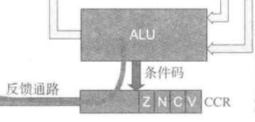
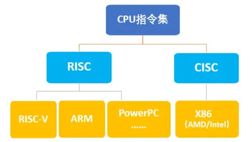

## 寄存器

### 什么是寄存器？

​	寄存器是处理器中**速度最快、容量最小的存储单元**，直接**集成在 CPU 内部**。它们**用于暂时存放数据和地址，以便快速访问和处理**。寄存器的数量和类型因指令集架构（ISA）的不同而有所差异，但大多数处理器都包含几种常见的寄存器类型。

**为什么需要寄存器？**

​	寄存器其实乍一看起来，似乎是最没必要存在的硬件。它既不参与任何的运算，容量也远比内存小得多，那直接让cpu去内存里面访问不就好了吗？为什么要多此一举将数据先从内存取出存入到寄存器中，再从寄存器中进行访问呢？

​	我们假设有一条三地址指令如下：

```assembly
OpCode address 1 ， address 2 ， address 3
```

​	其中，操作码为16位 , 地址空间为32位。如果直接访问内存，则该条指令中每个操作数大小均为32位。

16 + 32 + 32 + 32 = 112，一条指令显然不能够这么长，而且在这种条件下内存访问成本也大大增加。

​	而假设我们有16个寄存器，可以用4位寄存器的地址映射（2的4次方），则只需要直接从寄存器中拿数据即可。即：16  + 4 + 4 + 4 = 28，如此便合理多了。

​	因此选择将内存空间中的32位地址映射到寄存器是一个明智且必要的选择。

### 寄存器的分类

​	寄存器总共有如下三种类型：

**通用寄存器：**

​	通用寄存器用于**保存计算过程中所需要用到的，所产生的一些临时数据**。是**可见的寄存器**，可以由编程人员任意使用。例如ARM中通常有16个32位寄存器，编号分别为r0-r15。其中r0-r12便是通用寄存器，用于存储数据或地址，没有特定用途限制。

**不可见寄存器（特殊专用寄存器）：**

​	不可见寄存器顾名思义，是无法被编程人员看见的。其具有特定硬件功能的寄存器，不可随意修改。不可见寄存器**不属于处理器体系结构**，编程人员也无法直接使用。例如`PC`（程序计数器），`IR`（指令寄存器）等等。这些寄存器都是组成计算机所不可或缺的，但是并不属于ISA的一部分！

**特殊功能寄存器：**

​	具有特殊功能的寄存器。控制CPU工作模式或状态，通常由操作系统内核访问。例如常规的ARM架构处理器的`IR`寄存器--指令寄存器便是一个特殊功能寄存器，同时也是一个典型的不可见寄存器。

### 一些常见的功能寄存器

​	**IR 指令寄存器：**存放最近从内存中读取出的指令，也就是目前正在执行的指令。

​	**PC 程序计数器：**保存所要执行的下一条指令的位置。程序执行时CPU通过取出`PC`指向的地址取指令后再递增执行下一个地址。从而实现不断 取指-执行 的逻辑。

​	**MAR & MBR：**

​	 `MAR`，CPU内的一个内存地址寄存器，其中存储了CPU即将要访问的地址，告诉CPU接下来该从什么地址开始取数据；

​	`MBR`，CPU内的一个内存数据寄存器。根据`MAR`的地址找到数据后，并非直接将数据送入CPU的通用寄存器中，而是先将其送入`MBR`中，再从`MBR`中移送到寄存器和`IR`寄存器中。也就是说，**通用寄存器并非与内存进行直接的数据流通，而是通过`MBR`作为中介进行流通。**由`ALU`运算完毕后的结果，也不会直接从寄存器送回内存，同样要先经过`MBR`。

​	**CCR 条件码寄存器（状态码寄存器）：**对于`CCR`寄存器，不同的体系架构其名称不同，例如ARM中则被叫作`CPSR`（当前程序状态寄存器），而x86架构则称其为`EFLAGS` 状态寄存器。但是无论怎么称呼，其核心原理是一样的。

​	`CCR`寄存器主要作用是为条件分支指令提供依据。通过检查 `CCR` 中的标志位，处理器可以决定是否跳转到某个新的指令地址，从而实现复杂的控制流。



​	如上图，当`ALU`执行完一条指令的运算后，会更新`CCR`中的状态位。当执行到条件分支语句时，会检测上一条语句执行完毕后`CCR`的状态，若被检测位为`false`，则继续执行下一句，流程不发生跳转；若被检测位为`true`，则跳转到相应位置执行。

​	相关的标志位有 ： **Z（零位）**； **C（进位）** ； **N （判负）** ； **V（算数溢出）**等等

​	

## 计算机指令集架构

​	计算机指令集架构（Instruction Set Architecture，ISA）是计算机体系结构中非常重要的组成部分，它**定义了硬件与软件之间的接口**。ISA **规定了处理器能够执行的指令集及其格式、寄存器结构、寻址方式**等关键要素，确保程序可以在特定类型的处理器上正确运行。

​	ISA是一个抽象的规范，并不是具体的硬件实物。通过标准化指令集，不同厂商可以生产兼容的处理器，开发者可以编写跨平台的代码。

### ISA的组成：

​	指令集**是处理器能够执行的所有指令的集合**。每条指令通常由操作码（Opcode）和操作数（Operand）组成。**操作码表示指令将要执行的动作类型**。例如加，减，逻辑运算等等。而**操作数表示指令作用的对象，参与运算的数据源或目标**，例如寄存器或内存内的地址。

​	ISA还**定义了可用的寄存器类型和数量**，例如通用寄存器、状态寄存器、浮点寄存器等。

​	ISA**规定了CPU内部运算的寻址模式**。常见的寻址模式有：

1.**立即寻址**   	2.**直接寻址**	3.**间接寻址**	4.**相对寻址**等等。

​	ISA**也规定了数据类型的格式以及对于异常与中断的处理方法**等。

总的说来：

​	ISA是计算机系统中一个**关键的抽象层**，它规定了处理器支持的指令类型，包括算术运算、逻辑运算、数据传输和控制流等，描述了如何通过不同的寻址模式（如直接寻址、间接寻址、相对寻址）访问内存或寄存器中的数据，确定了处理器内部寄存器的数量、类型和用途，如通用寄存器、状态寄存器和程序计数器，同时也规定了数据类型和异常处理机制，确保系统稳定和可靠。

​	以x86为例，这是一个非常著名的指令集架构，广泛应用于个人电脑中。x86定义了一系列指令格式、寄存器配置、寻址模式等规则，使得所有遵循x86标准的处理器都能够运行相同版本的操作系统或应用程序代码。这意味着，无论是Intel还是AMD生产的处理器，只要它们都兼容x86架构，就可以使用相同的软件资源，这极大地促进了软件生态的发展。

### ISA的分类：

- **精简指令集结构（RISC）**

​		由复杂指令集发展而来，剔除掉了复杂指令集中许多不必要的指令，结果就产生了精简指令集，它所包含的指令比较少。

**RISC指令集简单，每条指令执行单一操作，采用固定长度指令格式，执行效率高。缺点就是对于复杂的操作往往需要更多的指令。**

ARM 架构便是 RISC 设计的典型代表之一。

- #### **复杂指令集结构（CISC）**

​		**指令数目多而复杂，每条指令字长并不相等，单条指令可以完成复杂的操作**，编程灵活，适合复杂任务。然而也因此特性，导致指令的解码复杂，执行效率低。由英特尔和 AMD 主导的 x86 架构便是最著名的 CISC 结构的代表。




## 高速缓存 (Cache) 

​	**高速缓存（Cache)**是位于CPU和内存之间的一种小容量、高速度的存储器。它的主要目的是减少CPU访问数据时的等待时间，提高系统的整体性能。Cache比主存快得多，但是缓存的容量非常有限，远远小于主存。

#### **为什么需要高速缓存?**

​	CPU的处理速度远远超过主存的访问速度。甚至达到了千万倍量级的差距，如果让CPU直接从内存取数据，则会大大降低工作的效率，为了缓解这一问题，引入了高速缓存：即通过将常用的数据和指令存储在缓存中，CPU可以直接从缓存中读取数据，从而大大减少了等待时间。

#### **缓存的工作原理**

​	缓存的基本工作原理是基于程序的局部性原理：**时间局部性**和**空间局部性**。

- **时间局部性**：如果一个数据项被访问过，它很可能在不久的将来再次被访问。
- **空间局部性**：如果一个数据项被访问过，它附近的内存区域也可能很快被访问。

​	基于这些局部性原理，**程序往往会重复访问相同的数据或相邻的数据，缓存会保存最近使用过的数据或指令，使得CPU在下次访问相同数据时可以直接从缓存中读取，而无需每次都访问较慢的主存。**这样，虽然缓存的容量有限，但它能够显著提高数据访问速度，从而提升整个系统的性能。

​	当缓存已满且需要存储新数据时，会根据一定的替换策略（如最近最少使用或先进先出）将旧数据替换出去，以确保缓存中的数据始终是最常用或最可能被访问的数据。

​	当CPU请求的数据已经在缓存中时，称为**缓存命中**。此时CPU可以直接从缓存中读取数据，无需访问主存。

​	当CPU请求的数据不在缓存中时，称为**缓存未命中**。此时CPU必须从主存中读取数据，并将其加载到缓存中以供后续使用。


#### **缓存层次结构**

- **L1 Cache**：最靠近CPU的核心，**速度最快但容量最小**（通常几KB到几十KB）。**每个CPU核心都有自己的L1缓存**。
- **L2 Cache**：比L1稍慢，但容量更大（通常几百KB到几MB）。可以是每个核心独享或多个核心共享。
- **L3 Cache**：最远离CPU核心，速度较慢但容量最大（通常几MB到几十MB）。**通常由所有核心共享**。

由内到外访问速度逐渐变慢，存储容量也在逐步变大。

####  **缓存替换策略**

- **LRU（Least Recently Used）**：替换最近最少使用的数据。
- **FIFO（First In First Out）**：按进入缓存的顺序替换最早进入的数据。（队列结构）
- **Random**：随机选择要替换的数据。

伪随机替换和 LRU 是当前最广泛使用的缓存替换策略。


## 游程

​	**游程（Run）是指在一个序列中连续出现的相同元素的子序列**。游程编码（Run Length Encoding, RLE）是一种简单的数据压缩技术，它通过将连续重复的数据替换为一个计数和该数据值来实现压缩。这种技术特别适用于具有大量重复数据的场景。

​	**最大游程**，在一个序列中，所有游程中最长的那个游程的长度。

​	假设我们有一个字符序列 "AAABBBCCCCCC"，使用游程编码后，可以表示为 "3A3B6C"。这样做的好处是减少了存储空间，特别是在数据中有大量重复的情况下。这也是游程压缩技术的原理。

### 游程编码的优点

- **简单易实现**：算法简单，易于理解和实现。
- **高效压缩特定类型的数据**：对于具有大量重复数据的序列，可以提供高效的压缩比。
- **无损压缩**：**是一种无损压缩方法，解压后的数据与原始数据完全一致。**

#### 缺点

- **不适合复杂数据**：对于没有大量重复数据的序列效果较差，甚至可能会增加数据大小。
- **不适用于随机数据**：如果数据是随机的，不仅不会压缩数据，反而可能会增加数据的大小。
- **压缩比有限**：与其他高级压缩算法相比其压缩比通常较低。

### 游程的应用

- 在网络通信中，可以用来减少数据传输量，特别是在传输大量重复数据时。特别是在低带宽或高延迟的环境中，减少数据量可以显著提高传输效率，从而节省带宽。
- 在某些文本文件中，特别是包含大量重复字符的数据（如DNA序列），可以显著减少存储空间。同样的道理，日志文件中的许多条目可能是重复的，采用游程压缩技术可以有效地压缩这些文件，减少存储需求。